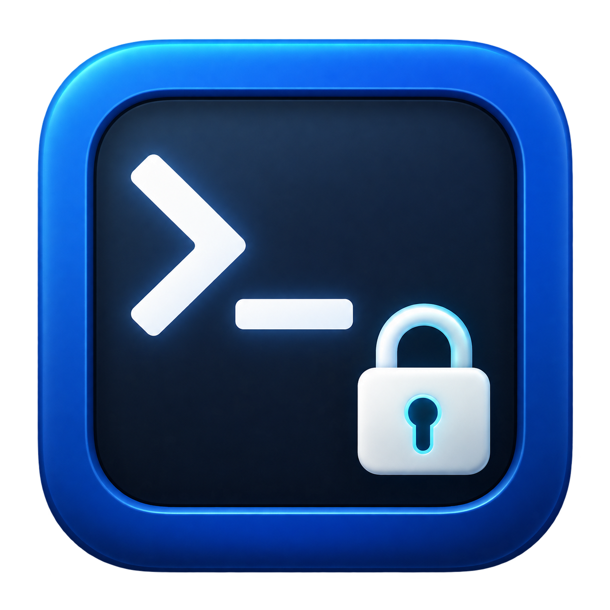

# MacSSHManager

**Mac SSH Manager** is a macOS menu-bar app for opening temporary SSH access to this Mac. Choose LAN, Tailscale, or both, approve the macOS administrator prompt, and access closes when the timer ends.

It controls inbound SSH on TCP port 22. It does not connect to other servers or manage SSH keys.

## What you can do

- Open access for 15, 30, or 60 minutes, or 3 or 6 hours.
- Choose LAN, Tailscale, or both for each window.
- Close access immediately and disconnect active SSH sessions.
- Review access changes and successful SSH session history.
- Enable launch at login or require local-console-only operation.

## Get started

The project is experimental. An [Apple Silicon installer](https://github.com/chandanankush/MacSSHManager/releases/tag/v1.0.0-beta.1) is available as a prerelease. Its package container is unsigned, and the app is locally signed rather than Apple-notarized. macOS 13 or later is the deployment target; verify your particular Mac before relying on it.

1. Download the PKG from the release and [verify it](docs/INSTALLATION.md#verify-a-release-installer), or [build your own installer](docs/INSTALLATION.md#prepare-an-installer).
2. Install from the target Mac's attached display and keyboard with administrator access. Use the installer package; copying the app alone does not install its controls.
3. Complete the guide's [acceptance checks](docs/INSTALLATION.md#physical-acceptance-tests), including confirming SSH is closed before login.
4. Open **Mac SSH Manager** from Applications.

Installation changes the Mac's firewall, Remote Login, and SSH authentication policy. Plan installation and removal locally.

## Open and close SSH

1. Select **LAN**, **Tailscale**, or both. Both are initially selected; Tailscale requires a running, supported IPv4 route.
2. Choose a duration and select **Open SSH**.
3. Approve the administrator prompt. Every new or replacement window requires fresh approval.
4. Select **Close now** when finished. Closing needs no authorization; expiry also closes access and disconnects active port-22 SSH sessions.

Access is designed to return to CLOSED after expiry or reboot, including when the menu app is unavailable. Verify that behavior using the installation checks. **Open SSH** is unavailable while enforcement is recovering, unavailable, or degraded.

**Local-console-only** is off initially. Enable it to block opening when supported remote-control services are detected; detection cannot establish physical presence against every remote-control tool. Disabling the setting requires administrator approval.

Choose **View full history** to search access events and successful SSH sessions. Local history includes usernames and source IP addresses; it does not record passwords, SSH keys, commands, or terminal contents.

## Help and removal

- [Installation, upgrade, troubleshooting, and rollback](docs/INSTALLATION.md)
- [Recovery when the security service is unavailable](docs/PACKET_FILTER_REBOOT_RECOVERY.md#menu-behavior)
- [Report a vulnerability privately](SECURITY.md); use [GitHub issues](https://github.com/chandanankush/MacSSHManager/issues) for other problems, with personal data redacted.

Uninstalling removes the port-22 protection and can make SSH reachable again. Follow the [rollback procedure](docs/INSTALLATION.md#rollback) from the attached console.

## For developers

See [Contributing](CONTRIBUTING.md), [Architecture](docs/ARCHITECTURE.md), and the [Security model](docs/SECURITY_MODEL.md). The project is available under the [MIT license](LICENSE); changes are listed in the [Changelog](CHANGELOG.md).
