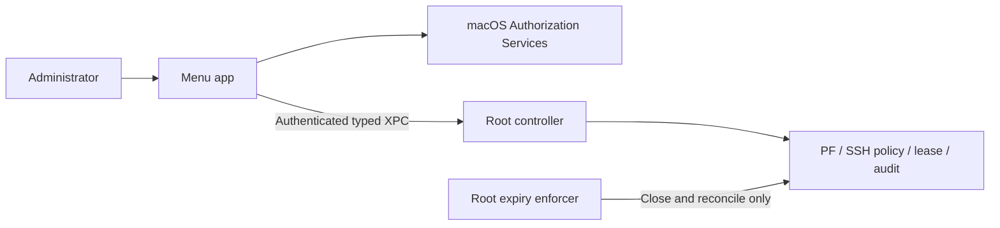

# Architecture

Mac SSH Manager separates its unprivileged menu UI from two root-owned helpers. It controls inbound SSH on TCP 22 for an administrator-approved LAN and/or Tailscale window. It is not an outbound SSH client or a general-purpose firewall.

Read the [security model](SECURITY_MODEL.md) for threat boundaries and limitations, and the [installation guide](INSTALLATION.md) for live acceptance checks.

## Source layout

| Module | Responsibility |
| --- | --- |
| `Sources/SharedProtocol` | Typed XPC requests, status, leases, audit DTOs, and fixed installed paths |
| `Sources/MenuApp` | Menu UI, authorization requests, authenticated controller client, and history view |
| `Sources/ControllerDaemon` | Validated XPC listener and root controller entry point |
| `Sources/SecurityCore` | Authorization, client identity, PF, SSH policy, leases, closure, and auditing |
| `Sources/ExpiryEnforcer` | Independent close-only root process |
| `Installer` | Signed package assembly, installation, and removal |

`ProductionComposition` wires the real enforcement collaborators. Tests use fakes for privileged operations; they do not install the app or change live PF/SSH configuration.



The app product is **Mac SSH Manager.app**; the project and main scheme are `MacSSHManager`. Installed service identifiers remain `com.serverpc.ssh-control`, with state under `/Library/Application Support/ServerPCSSHControl`, for upgrade compatibility.

## Components

### Menu-bar application

The unprivileged application uses an AppKit status item and popover with
SwiftUI content in the interactive user session. It displays:

- `SSH CLOSED`, or `SSH OPEN` with the remaining time.
- Two independent `LAN` and `Tailscale` checkboxes selecting the network
  scope for the next OPEN or replacement window. Both default ON. OPEN is
  unavailable when neither is selected; the selection is never inferred from
  whether Tailscale happens to be installed or running.
- Fixed OPEN choices of 15 minutes, 30 minutes, 60 minutes, 3 hours, and
  6 hours. The default selection is 30 minutes.
- `Close now`, which never asks for authorization.
- A retained `Require local-console-only` setting.
- Health and degraded-state information returned by `status`.

The application has no command-line control, URL scheme, AppleScript API,
HTTP listener, network listener, SFTP feature, or generic execution feature.
It cannot modify PF or privileged files.

### Root controller daemon

A root LaunchDaemon is installed and bootstrapped by the administrator-authorized
package script. Its XPC interface contains only typed operations:

```text
requestOpen(duration, lan, tailscale, authorizationExternalForm, requestNonce)
requestClose()
setLocalConsoleOnly(enabled, authorizationExternalForm?, requestNonce?)
status()
retrySecurityService()
recentAuditHistory(query)
```

The duration is an enum, not an integer supplied by the client. `lan` and
`tailscale` are booleans that only ever select among three fixed scopes
(LAN, Tailscale, or both); the daemon independently resolves and validates
what each selected scope actually means on the host, and rejects a request
that selects neither. The helper accepts no commands, paths, executables,
arguments, environment variables, interfaces, subnets, PF rule text, process
identifiers, or shell input.

Every connection is validated against the expected installed application
identity and root-owned application location. Release installation requires a
code-signed bundle. Development or unsigned builds cannot perform privileged
operations on the host.

The daemon uses fixed absolute executable paths where a system tool is
unavoidable and never invokes a shell. All values derived from system output
are parsed into bounded typed values and revalidated immediately before use.

### Independent expiry enforcer

A separate root launchd job has no XPC listener. It can only inspect the
root-owned lease and enforce CLOSED. It runs at boot, at a short fixed
interval, and at the recorded deadline. It protects expiry when the UI or
controller fails.

The enforcer treats missing, malformed, expired, future-invalid, or
previous-boot state as CLOSED. It never opens access.

### PF anchor

PF is the macOS BSD Packet Filter. This administrator-operated
tool uses one dedicated anchor. Runtime helpers update only that anchor and never flush unrelated rules or replace another product's anchor. Installation syntax-checks and reloads the complete managed `/etc/pf.conf`; verify unrelated rules still work during acceptance.

The persistent anchor reference is installed idempotently only after the full
PF configuration passes syntax validation. The anchor's boot rule blocks
inbound TCP port 22 on every interface.

During OPEN, the anchor is atomically replaced with rules generated from the
authorized network scope, in this fixed order:

1. If LAN is authorized: permit inbound TCP port 22 only on the physical
   interface and source subnet captured for the approved LAN window.
2. If Tailscale is authorized: permit inbound TCP port 22 only on the single
   validated Tailscale interface, from Tailscale's documented CGNAT range
   (`100.64.0.0/10`), to the host's own captured Tailscale address.
3. Block inbound TCP port 22 on every other interface and source.

The implementation must verify the loaded anchor rules after every transition
against the exact snapshot that transition authorized -- not merely that
some pass-rule-shaped anchor is loaded. It must never disable PF. If PF, the
anchor, or the enforcer is unhealthy, OPEN fails closed.

Apple treats PF as an advanced user and site-administrator mechanism, not as a
supported API for firewall products distributed broadly. Publishing this source
does not establish suitability for general binary distribution. See Apple's
[TN3165: Packet Filter is not API](https://developer.apple.com/documentation/technotes/tn3165-packet-filter-is-not-api).

## Authorization policy

OPEN, extension, duration replacement, and changing
`Require local-console-only` from ON to OFF require fresh OS-managed
administrator authorization.

The custom authorization right is non-shared and has zero reuse timeout. The
menu application requests the right through Authorization Services, and
SecurityAgent presents the OS interaction. The daemon reconstructs and checks
the right immediately before the privileged operation. A successful external
form and request nonce are consumed once and cannot authorize a second action.

macOS may use the administrator password, Touch ID, Apple Watch, or another
supported OS mechanism. The application sees only success or failure.

CLOSE and changing `Require local-console-only` from OFF to ON do not require
authorization because both operations reduce access.

## Network scope selection

Every OPEN carries an explicit network scope: LAN, Tailscale, or both. The
scope is never derived from a UI string or trusted from the XPC caller --
the daemon independently resolves and validates each requested path before
authorizing anything, and rejects a request that selects neither.

### LAN

At successful OPEN with LAN in scope, the daemon selects the physical
interface carrying the current default route and snapshots its directly
connected source subnet. Loopback, `utun`, bridge, VPN, Docker, Colima, and
other virtual interfaces are excluded from the allow rule.

The subnet is not required to be private. A public or otherwise unusual subnet
produces an audit warning but does not block an administrator-approved OPEN.

The rule does not automatically follow a later interface or subnet change.
Such a change is audited only -- it never closes the window and never widens
or replaces the originally captured rule. Access on the new LAN requires a
new, freshly authorized OPEN. The original lease continues until close or
expiry, although its snapshotted rule may no longer be reachable.

### Tailscale

At successful OPEN with Tailscale in scope, the daemon identifies the current
Tailscale interface without ever hardcoding a `utunN` number. Exactly one
local interface must independently satisfy three narrow, root-owned signals
at once: a `utun`-prefixed name, a point-to-point host route (`/32`), and an
address inside Tailscale's documented, stable CGNAT allocation
(`100.64.0.0/10`, see Tailscale's
[reserved IP addresses](https://tailscale.com/kb/1015/100.x-addresses) and
[macOS variants](https://tailscale.com/kb/1065/macos-variants) references).
Zero or more than one candidate fails closed. The exact interface/address
shape this assumes must be confirmed by inspection on the actual installed
machine and Tailscale variant before it is relied upon; it is not assumed to
be identical across every macOS Tailscale distribution.

The Tailscale pass rule is bound to that one validated interface, admits only
Tailscale's CGNAT source range, and is additionally narrowed to the host's
own captured Tailscale destination address. This scope is IPv4-only, matching
the LAN scope; Tailscale's IPv6 address on the same node is never passed by
any scope.

A live Tailscale interface renumbering, address change, ambiguity, or
disappearance is treated differently from a LAN change: it is audited **and**
closes the window immediately, requiring a freshly authorized OPEN. A rule
bound to a freed `utunN` name is never left running, because that name can
later be reused by an unrelated interface.

Tailnet ACL/grant configuration restricting which peers may reach TCP 22 is a
required independent external layer, not something this tool enforces or can
verify -- it complements, and does not replace, the interface- and
range-scoped PF rule.

## Local-console-only setting

`Require local-console-only` defaults to OFF on first installation and retains
its last state across application restarts and reboots. The setting is stored
in root-owned state; ordinary user defaults are not authoritative.

While this setting is OFF, there is still no network activation API and OPEN
still requires fresh OS administrator authorization. However, the utility does
not claim strict physical presence against a remote desktop session that can
interact with the local macOS UI. This is the explicitly selected default
trade-off.

When enabled, OPEN is refused if the supported detector reports macOS Screen
Sharing, Remote Management, or a reviewed known remote-control process as
running. A registered built-in service that reports `state = not running`
does not block OPEN. The enforcer continues checking during an open window and
closes access if a supported prohibited service becomes active.

Built-in service checks are enforced hard. A reviewed list of third-party
process and service identifiers is defense in depth because software cannot
reliably enumerate every remote-control mechanism.

Enabling the setting is immediate and password-free. Disabling it requires
fresh OS authorization and creates an audit event.

## Lease and transitions

The root-owned lease contains only:

- Schema version (bumped whenever the lease shape changes; an unrecognized or
  prior version always fails closed rather than being partially trusted).
- Request identifier.
- Selected fixed duration.
- Same-boot monotonic or continuous deadline.
- Wall-clock display timestamps.
- Boot-session identifier.
- The authorized network scope (LAN, Tailscale, or both).
- The captured physical interface and subnet, present only when LAN is in
  scope.
- The captured Tailscale interface and address, present only when Tailscale
  is in scope.
- Local-console-only state used for the decision.

It contains no credential, authorization external form, SSH key material,
secret, command, or email/application data. Writes use a temporary file,
`fsync`, atomic rename, root ownership, and restrictive permissions.

### OPEN

1. Validate the signed caller, request nonce, fixed duration, authorization,
   PF health, anchor installation, enforcer health, and public-key-only SSH
   configuration.
2. Evaluate the optional local-console policy.
3. Discover and validate the active physical LAN.
4. Persist the lease atomically.
5. Load the temporary allow rules atomically.
6. Read back and verify the effective anchor.
7. Return OPEN only after verification succeeds.

Any failure restores the blocking anchor, removes the lease, records a
sanitized audit event, and returns a structured error.

### Extension or duration change

An extension or duration change is a new OPEN request requiring fresh OS
authorization. The replacement duration starts from successful authorization;
durations never accumulate.

### CLOSE and expiry

1. Restore and verify the blocking anchor first.
2. Enumerate established TCP connections whose local port is 22.
3. Revalidate each owning process as an `sshd` session process immediately
   before sending a fixed termination signal.
4. Retry bounded termination and verify that no established port-22 session
   remains.
5. Remove the lease.
6. Record the transition.

The helper never accepts process identifiers from a caller. It must not flush
the complete PF state table, because doing so would disrupt unrelated
connections. If session termination is incomplete, the blocking rule remains,
the UI reports degraded CLOSED, and both root jobs continue bounded retries.

## Crash, sleep, clock, and reboot behavior

- UI crash does not alter the lease.
- Controller crash is restarted by launchd; the independent enforcer remains
  able to close access.
- Sleep counts toward expiry by using a clock that includes sleep.
- Wall-clock rollback or advance cannot extend the lease.
- Wake after deadline triggers immediate close.
- Reboot invalidates every lease through the boot-session identifier.
- The persistent PF configuration starts with the blocking anchor, and the
  enforcer's first action at boot is to verify CLOSED.
- Failure to prove PF, anchor, enforcer, authorization, or SSH policy health
  makes OPEN unavailable.

Installation checks PF enabled and the named CLOSED anchor. It does not prove that the live parent ruleset reaches that anchor or that blocking precedes SSH startup. The physical acceptance procedure must independently verify startup ordering and port-22 blocking before login on the target macOS release.

## SSH policy

The tool does not inspect, copy, expose, delete, rotate, or replace any SSH
private key or server-side public key. Installation creates one root-owned,
package-managed SSH configuration fragment that disables password,
keyboard-interactive, and root login while enabling public-key authentication.
Disabling root login makes a validated non-root `sshd` account an unambiguous
post-authentication identity for successful-session history.

Before enabling operation, installation verifies effective normal-port-22 SSH
policy includes:

```text
PasswordAuthentication no
KbdInteractiveAuthentication no
PubkeyAuthentication yes
PermitRootLogin no
```

The check is read-only and does not print keys or authorized-key contents. A
failed or ambiguous effective-policy check prevents OPEN. The installer
verifies its exact managed fragment in the effective policy before making the
menu application available. Uninstallation removes only that exact,
package-owned fragment and restores the previous effective configuration.

## Audit

The root components emit bounded event metadata through Unified Logging and a
bounded, root-owned rotating audit file. Events include:

- Installation and policy validation.
- OPEN requested, authorized, denied, succeeded, or failed.
- Manual CLOSE.
- Automatic expiry.
- Extension or duration replacement.
- Local-console setting changes and detector decisions.
- Public or changed-network warnings.
- Invalid client, nonce, duration, authorization, state, or caller rejection.
- Controller recovery, enforcer recovery, and boot-forced close.
- Incomplete session termination and retry outcome.

Events may contain timestamps, duration enum, local UID and audit session,
request identifier, network scope, LAN interface name and subnet, Tailscale
interface name and address, reason code, and result. They must never contain
passwords, biometrics, authorization blobs, SSH keys, Tailnet status output,
arbitrary environment data, commands, email/application data, or raw process
arguments.

Audit-write failure never permits OPEN. Audit failure during CLOSE cannot
prevent closing and is reported as degraded status.

## Structured errors and UI states

The protocol uses stable reason codes rather than passing privileged command
output to the UI. UI states are:

- `closed`
- `opening`
- `open(deadline)`
- `closing`
- `degraded_closed(reason)`
- `unavailable(reason)`

There is no degraded-open state. Any uncertainty while opening results in
CLOSED. Error text is bounded and sanitized.

For startup retries, read-back checks, and recovery logging, see [PF recovery](PACKET_FILTER_REBOOT_RECOVERY.md).
